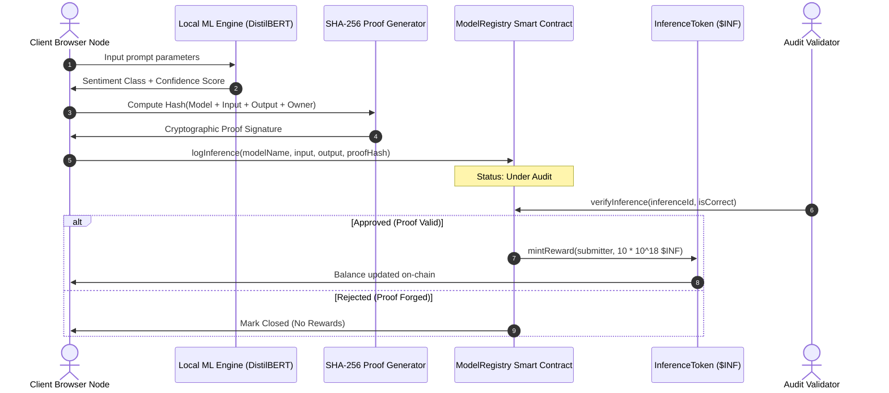

# 🧬 PoVI Sandbox — Trustless AI Inference Verification

> **The industry is full of "AI + Web3" slides. This is the running code.** 
> PoVI (Proof of Verifiable Inference) is a lightweight, zero-trust sandbox built to solve a critical bottleneck: *How do you verify that a client-side AI model actually generated a specific prediction, without running expensive neural networks directly inside a gas-constrained EVM?*

---

## ⚡ The Mechanism: Off-Chain Work, On-Chain Proof

Instead of executing complex tensors on-chain, PoVI splits the labor:
1. **Decentralized Execution:** The browser node runs the ML model locally (using `@huggingface/transformers` or a local heuristic).
2. **Cryptographic Commitment:** The node generates a SHA-256 hash containing: `Hash(Model_Metadata + Input_Payload + Output_Sentiment + Submitter_Address)`.
3. **Optimistic Ledger Entry:** Only the proof hash and raw metadata are recorded on the local Hardhat ledger via the `ModelRegistry` contract.
4. **Validation Work:** Validators inspect the transaction and verify that the output matches the input for that specific model.
5. **Tokenized Reward:** Valid proofs trigger automatic ERC-20 (`$INF`) token minting to the node owner's address.



---

## 🛠️ The Tech Architecture

*   **Runtime:** Next.js (React 19, TypeScript)
*   **Decentralized Ledger:** Hardhat (Solidity v0.8.20+)
*   **Web3 Connector:** Ethers.js (v6)
*   **Local Inference:** Hugging Face Transformers.js
*   **Aesthetics:** Dark-cyber backdrop, frosted glass cards, dynamic performance telemetry, and glowing validation indicators.

---

## 📦 Setting Up the Sandbox

Get the local ledger, compiler, and dashboard up and running in under 2 minutes.

### 1. Install Dependencies
```bash
npm install
```

### 2. Launch Local Blockchain Node
Spin up a local EVM network running on `http://127.0.0.1:8545`:
```bash
npx hardhat node
```

### 3. Deploy Smart Contracts
Compile and deploy the Solidity registry and token contracts:
```bash
npx hardhat run scripts/deploy.js --network localhost
```
*The deployment script automatically binds contract addresses to `src/app/contracts.json`.*

### 4. Run UI Dashboard
```bash
npm run dev
```
Open [http://localhost:3000](http://localhost:3000) to access the telemetry workstation.

---

## 🛡️ License & Fair Use

This project is dual-licensed under:

### 1. MIT License
Standard permission to copy, modify, distribute, and run this codebase commercially or privately, subject only to the standard MIT disclaimer.

### 2. The PoVI Developer Fair-Use Covenant
*   **Keep it Verifiable:** If you fork this project to build a commercial decentralized inference network, you covenant to maintain open verification logs for your users.
*   **No Black Boxes:** All validation algorithms and proof generation scripts must remain open-source to prevent audit collusion.
