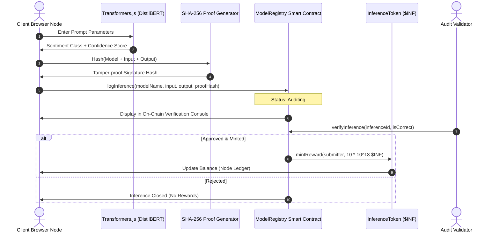

# 🧬 PoVI Playground — Proof of Verifiable Inference

A next-generation, high-fidelity decentralized audit playground for client-side Machine Learning. PoVI allows browser-based tensor calculation nodes to log execution proofs on-chain, enabling automated validation, node rankings, and smart contract token incentives ($INF).

---

## 🚀 Key Features

*   **In-Browser ML Calculations:** Runs client-side sequence classification using `@huggingface/transformers` (DistilBERT) or a custom local heuristic model.
*   **Cryptographic Commitments:** Computes SHA-256 hash signatures of inputs and outputs to generate tamper-proof inference verification proofs.
*   **Local Hardhat Integration:** Simulated blockchain ledger running local RPC connections, smart contracts, and wallet address tracking.
*   **Node Leaderboard & Telemetry:** Dynamic active node ranks showing accuracy metrics, progress trackers, and ownership addresses.
*   **On-Chain Verification Console:** Interactive audit workbench allowing validation nodes to approve/reject logged proofs, triggering automated reward token minting.
*   **Ultra-Premium Dashboard UI:** Modern dark-mode layout featuring custom cybernetic grid overlays, glassmorphic card containers, and glowing status telemetry feedback.

---

## 📐 System Architecture



---

## 🛠️ Tech Stack

*   **Frontend Framework:** Next.js (React 19, TypeScript)
*   **Web3 Integration:** Ethers.js (v6)
*   **Local Ledger:** Hardhat (Solidity contracts)
*   **Machine Learning Engine:** Hugging Face Transformers.js
*   **Fonts & Typography:** Outfit & Plus Jakarta Sans via Next.js native loading

---

## 📦 Getting Started & Setup

Follow these steps to spin up the local blockchain network, deploy the smart contracts, and launch the web app dashboard.

### Prerequisites

Ensure you have [Node.js](https://nodejs.org/) installed (v18+ recommended).

### 1. Install Dependencies

Clone the repository and install all node packages:
```bash
npm install
```

### 2. Startup Local Blockchain Node

Start a local Hardhat network. This node will run on `http://127.0.0.1:8545`:
```bash
npx hardhat node
```

### 3. Deploy Smart Contracts

In a separate terminal window, run the deploy script to compile the Solidity files and publish the `ModelRegistry` and `InferenceToken` contracts to the local network:
```bash
npx hardhat run scripts/deploy.js --network localhost
```
*Note: This script automatically updates `src/app/contracts.json` with the deployed contract addresses.*

### 4. Run Development Server

Launch the Next.js local development server:
```bash
npm run dev
```

Open [http://localhost:3000](http://localhost:3000) to view your new premium dashboard.

---

## 📜 Smart Contracts Details

### `ModelRegistry.sol`
Manages model node registration, logs input payload data along with their respective output prediction classes and cryptographic SHA-256 signatures, and provides the audit validation endpoints for reward minting.

### `InferenceToken.sol`
An ERC-20 token ($INF) utilized for rewarding verified ML computing nodes. Models with high verification accuracy are rewarded with minted tokens on-chain.
