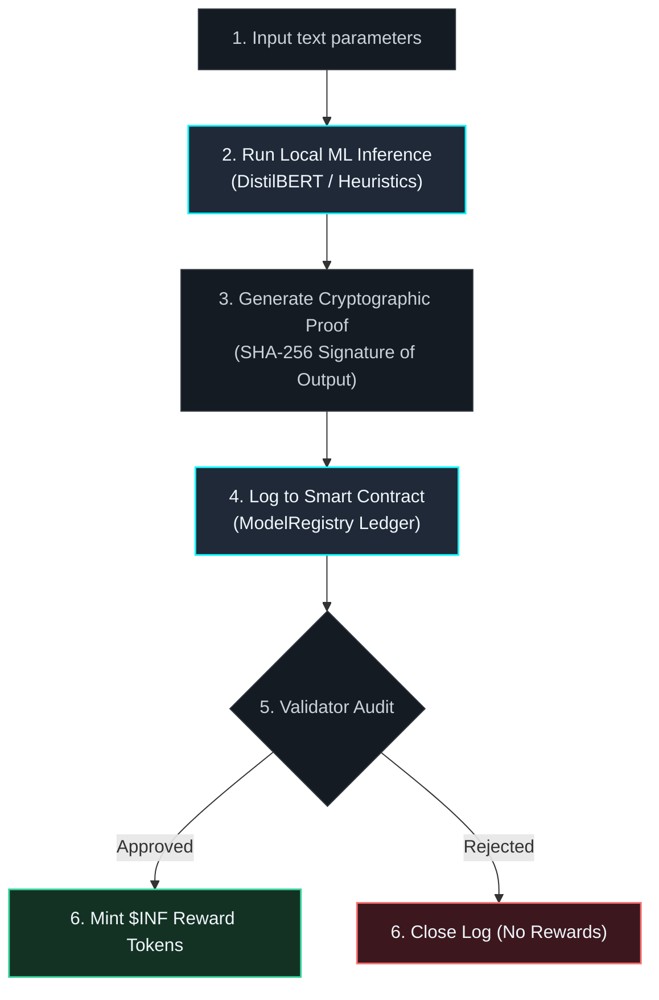

# 🔬 Proof of Verifiable Inference (PoVI)

[](https://opensource.org/licenses/MIT)

A trustless protocol for verifying client-side machine learning inference on decentralized ledgers without executing neural networks inside gas-constrained EVM environments.

---

## Overview

PoVI addresses a fundamental challenge in decentralized AI: **How can we cryptographically verify that a client-side model produced a specific prediction without running expensive neural network computations on-chain?**

This repository provides a complete sandbox environment demonstrating a practical solution — combining off-chain inference computation with on-chain verification and incentive mechanisms.

---

## Architecture

The protocol distributes computational responsibilities across two domains:

- **Off-Chain**: Model inference and cryptographic proof generation execute client-side using DistilBERT or heuristic-based classifiers
- **On-Chain**: A lightweight registry contract stores inference proofs, manages validator consensus, and distributes ERC-20 token rewards



---

## Repository Structure

```
.
├── src/app/                    # Next.js frontend application
│   ├── page.tsx                # Dashboard, telemetry, leaderboard, and validation interfaces
│   ├── globals.css             # Custom styling with ambient effects and glassmorphic components
│   └── web3.ts                 # Ethers.js integration for blockchain connectivity
├── contracts/                  # Solidity smart contracts
│   ├── ModelRegistry.sol       # Inference proof logging and validator approval management
│   └── InferenceToken.sol      # ERC-20 token ($INF) for validator rewards
└── scripts/
    └── deploy.js               # Contract compilation and deployment automation
```

---

## Quick Start

### Prerequisites
- [Node.js](https://nodejs.org/) (v18 or later recommended)

### Installation & Setup

**1. Install dependencies**
```bash
npm install
```

**2. Launch local blockchain node**
```bash
npx hardhat node
```
Runs on `http://127.0.0.1:8545` with pre-funded accounts.

**3. Deploy smart contracts**
```bash
npx hardhat run scripts/deploy.js --network localhost
```
Contract addresses and ABIs are automatically written to `src/app/contracts.json`.

**4. Start the development server**
```bash
npm run dev
```
Open [http://localhost:3000](http://localhost:3000) to access the dashboard.

---

## License

This project is distributed under a dual-license model:

### MIT License
You are free to use, copy, modify, merge, publish, distribute, sublicense, and/or sell copies of the software for any purpose, subject to the conditions of the MIT License.

### Contributor Covenant
- **Transparency**: Commercial deployments built on this protocol must maintain publicly accessible validation metrics.
- **Reciprocity**: Improvements to verification efficiency or proof generation security should be contributed back via Pull Request when feasible.

---

## Contributing

Contributions are welcome. Please open an issue to discuss proposed changes before submitting a pull request.
