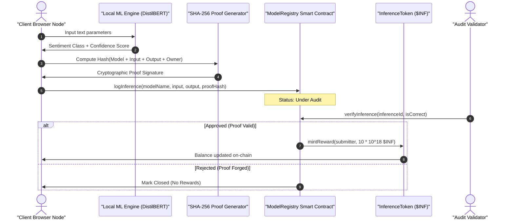

# 🧬 Welcome to the PoVI Sandbox! ✨

Hello there, builder! We are so glad you found your way to the **Proof of Verifiable Inference (PoVI) Playground**. 

This repository is a warm, interactive space designed for developers, researchers, and creators interested in bridging the gap between **Client-Side Machine Learning** and **Decentralized Ledgers**. 

Instead of heavy corporate marketing slides, we built a fully functional, running sandbox to address a core challenge: *How do we trustlessly verify that a client-side AI model actually generated a specific prediction without running slow, expensive neural networks inside a gas-constrained EVM?*

We hope you have fun exploring it! 🚀

---

## 🗺️ Finding Your Way Around (Repo Map)

To help you navigate the codebase, here is a quick tour of where everything lives:

*   📂 **`src/app/`** — *The Workstation:* This is the heart of the Next.js frontend application.
    *   [page.tsx](file:///c:/Users/Projects/ops-2/src/app/page.tsx) — The dashboard controls, active telemetry screens, leaderboard, and validation consoles.
    *   [globals.css](file:///c:/Users/Projects/ops-2/src/app/globals.css) — Custom ambient glows, grid backgrounds, and glassmorphic aesthetics.
    *   [web3.ts](file:///c:/Users/Projects/ops-2/src/app/web3.ts) — The Ethers.js integration code connecting the frontend to your local blockchain network.
*   📂 **`contracts/`** — *The Trust Engine:* The Solidity smart contracts.
    *   [ModelRegistry.sol](file:///c:/Users/Projects/ops-2/contracts/ModelRegistry.sol) — Handles logging of inference proofs and validator approvals.
    *   [InferenceToken.sol](file:///c:/Users/Projects/ops-2/contracts/InferenceToken.sol) — An ERC-20 token (`$INF`) minted to reward verified nodes.
*   📂 **`scripts/`** — *The Glue:*
    *   [deploy.js](file:///c:/Users/Projects/ops-2/scripts/deploy.js) — The deployment script that compiles the contracts and connects them to the frontend.

---

## ⚡ The Sandbox Workflow

Here is how the data flows from your browser to the blockchain. We use a combination of off-chain compute and on-chain validation:



---

## 🛠️ Let's Get Started! (Step-by-Step Setup)

Follow these friendly steps to set up your local development environment.

### Prerequisites
Make sure you have [Node.js](https://nodejs.org/) installed on your machine.

### 1. Install Dependencies
Get all the required packages installed locally:
```bash
npm install
```

### 2. Spin Up a Local Blockchain Node
Start a local Hardhat simulation network. This node runs locally on `http://127.0.0.1:8545`:
```bash
npx hardhat node
```

### 3. Compile and Deploy the Smart Contracts
In a new terminal tab, run the deploy script to publish the Solidity contracts:
```bash
npx hardhat run scripts/deploy.js --network localhost
```
*Note: This automatically writes contract metadata and addresses to `src/app/contracts.json` so the frontend knows how to talk to them.*

### 4. Launch the Telemetry Workstation
Run the Next.js development server:
```bash
npm run dev
```
Open **[http://localhost:3000](http://localhost:3000)** in your browser and check out the interactive dashboard!

---

## 🤝 Collaborative Dual Licensing

To support both open innovation and fair contribution, this project is licensed under a dual model:

### 1. The Permissive MIT License
You are free to copy, modify, distribute, and build upon this code for any personal or commercial use.

### 2. The Dev-to-Dev Fair-Use Covenant
*   **Keep it Honest:** If you use this repository to launch a commercial machine learning audit network, you promise to keep validation metrics transparent and accessible to the public.
*   **Share the Love:** If you find ways to improve the verification speed or proof generation safety, submit a Pull Request! We'd love to learn from your work and improve together.
